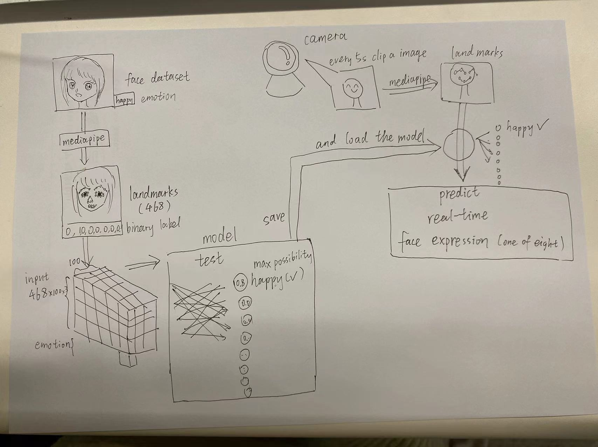

# realtime facial expression multi-class classification using mediapipe and transformers
everything is in **emotorch.ipynb**, check it

What I did was:

# Train a model
1. use PyTorch to construct a transformer muti-class classification network
2. download the dataset from https://www.kaggle.com/datasets/tapakah68/facial-emotion-recognition
3. do the preprocess: convert the dataset into a dataframe containing image addresses and emotion labels
4. use mediapipe to extract 468 face landmarks from each face of the dataset and add to the dataframe
5. convert the emotion labels (8 classes) into binary, like [1,0,0,0,0,0,0,0] (refers to 'angry')
6. do the train-test split (10% testing set)
7. train the model using the 468 landmarks and binary emotion labels as input, run 10 epoches (due to hardware limitations) 
8. test the model on testing set
9. save the model

# Use the model in the camera
1. load the model
2. open my camera, clip an image every 5 seconds
3. use media pipe to recognize my face and extract landmarks at real-time
4. use the landmarks as input, as my model to predict the outcome
