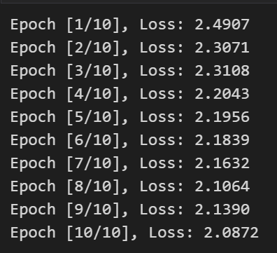

# Real-time Facial Expression Multi-Class Classification Using MediaPipe and Transformers

Hi there! I'm Lareina. This is a real-time facial expression classification system using a transformer-based multi-class classification model with PyTorch, MediaPipe for facial landmark extraction, and a pre-trained model for predictions.

Everything you need to know is in `<src/emotorch.ipynb>`. Please check the notebook for implementation details.


## Overview

### Model Training Process
1. **Model Construction**: 
   - Used PyTorch to construct a transformer-based multi-class classification network.
   
2. **Dataset**:
   - Downloaded the dataset from [Kaggle: Facial Emotion Recognition](https://www.kaggle.com/datasets/tapakah68/facial-emotion-recognition).
   
3. **Preprocessing**:
   - Converted the dataset into a dataframe that contains image file paths and corresponding emotion labels.
   
4. **Feature Extraction**:
   - Applied MediaPipe to extract 468 facial landmarks from each face in the dataset and added them to the dataframe.

5. **Label Conversion**:
   - Converted the emotion labels (8 classes) into a binary vector format, such as `[1, 0, 0, 0, 0, 0, 0, 0]` to represent the 'angry' emotion.

6. **Data Splitting**:
   - Split the data into training and testing sets (10% for testing).
   
7. **Model Training**:
   - Trained the model using the 468 facial landmarks as input and the binary emotion labels as output. The training was run for 10 epochs (due to hardware limitations).

   

8. **Testing**:
   - Evaluated the model on the testing set.
   
9. **Model Saving**:
   - Saved the trained model for later use.

### Real-Time Prediction with Webcam
1. **Model Loading**:
   - Loaded the trained model for real-time predictions.

2. **Webcam Capture**:
   - Opened the webcam and captured an image every 5 seconds.

3. **Landmark Extraction**:
   - Used MediaPipe to detect the face and extract facial landmarks in real time.

4. **Emotion Prediction**:
   - Passed the extracted landmarks to the model to predict the emotion label in real-time.

   

## Requirements
- Python 3.x
- PyTorch
- MediaPipe
- OpenCV
- Pandas
- NumPy

You can install the required packages by running:

```bash
pip install torch mediapipe opencv-python pandas numpy
